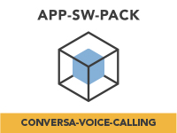
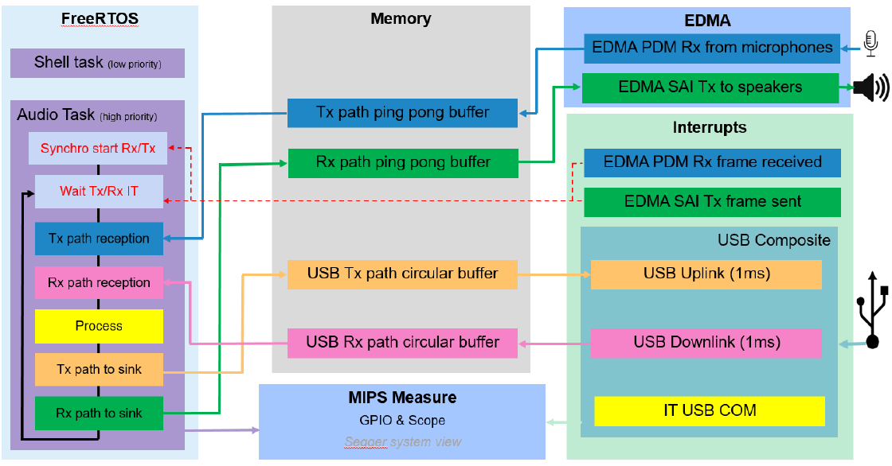

<p align="center">
	
</p>

<h1 align="center">Conversa Voice Calling</h1>

This repository holds the [Conversa Voice Calling App SW Pack](https://www.nxp.com/design/software/embedded-software/application-software-pack-conversa-voice-calling-on-i-mx-rt1170:APP-SW-PACK-CONVERSA-VOICE) and depends on the MCUXpresso SDK overall delivery.

## Resources
* Purchase supported board.
    * [MIMXRT1170-EVK](https://www.nxp.com/design/development-boards/i-mx-evaluation-and-development-boards/i-mx-rt595-evaluation-kit:MIMXRT1170-EVK)
* Install [MCUXpresso IDE v11.6.0+](https://www.nxp.com/design/software/development-software/mcuxpresso-software-and-tools-/mcuxpresso-integrated-development-environment-ide:MCUXpresso-IDE).
* [Application Note AN13752](https://www.nxp.com/doc/AN13752) - Covers technical details of the software pack.
* Download and install [Conversa Tuning Tool](https://www.nxp.com/design/software/embedded-software/application-software-pack-conversa-voice-calling-on-i-mx-rt1170:APP-SW-PACK-CONVERSA-VOICE).
* [Lab Guide](https://www.nxp.com/doc/AN13752) and [Video Walkthrough](https://www.nxp.com/pages/:TIP-APP-SW-PACK-CONVERSA-VOICE-CALLING) - Walks you through downloading, importing, and running the software pack.

## Assemble the Application
You need to have both Git and [West](https://docs.zephyrproject.org/latest/develop/west/index.html) installed, then execute below commands to gather the whole APP-SW-PACKS/CONVERSA-VOICE-CALLING delivery at revision ```${revision}``` and place it in a folder named ```appswpacks_conversa_voice_calling```. 
```
west init -m https://github.com/nxp-mcuxpresso/appswpacks-conversa-voice-calling --mr ${revision} appswpacks_conversa_voice_calling
cd appswpacks_conversa_voice_calling
west update
```
Replace ```${revision}``` with any SDK revision you wish to achieve. This can be ```mcux_release_github``` if you want the latest state, or any commit SHA.

You can find more information about setup the application software pack in the Audio Lab Guides included in the [AN13752](https://www.nxp.com/doc/AN13752). 

## Build and Run the Application
To build and run the application please refer to the chapter 5. Audio Lab Guides within the AN13752.

## Application Overview
This software application pack enables a complete voice call application using NXP’s i.MX RT1170 crossover MCU and Conversa Voice Suite.

After initializing the necessary hardware, the demo launches a Shell task:
1. **Shell Task:** Waits for user input to select one of the software configurations. Type help to see all the available options:

    With Conversa Voice Suite processing

        voicecall spswp16k    => Speaker phone with Conversa software (required voice call RT1170 mockup). Teams conferencing device 2.3m. Fs=16kHz
        voicecall spswp32k    => Speaker phone with Conversa software (required voice call RT1170 mockup). Teams conferencing device 2.3m. Fs=32kHz.

    Without Conversa Voice Suite processing

        voicecall usbswp16k    => USB microphones and USB speaker. Fs=16kHz
        voicecall usbswp32k    => USB microphones and USB speaker. Fs=32kHz

        WARNING : FOR lb CONFIGURATION REMOVE SPEAKER JACK CONNECTOR AND PLUG A HEADSET TO AVOID LARSERN EFFECT AND DAMMAGE SPEAKER: WARNING
        WARNING : FOR lb CONFIGURATION REMOVE SPEAKER JACK CONNECTOR AND PLUG A HEADSET TO AVOID LARSERN EFFECT AND DAMMAGE SPEAKER: WARNING

        voicecall lbswp16k    => Loop back between microphones and headset + Usb microphones. Fs=16kHz
        voicecall lbswp32k    => Loop back between microphones and headset + Usb microphones. Fs=16kHz


    RT1170 mockup : RT1170 EVKA (3 microphones used) + TA2024 amplifier + 1 TangBand 2136 speaker

    sp: sp means speaker phone with Conversa software. Conversa Tx output is sent to Tx Usb channel 0. Conversa Rx output is sent to the speaker.

    usb : usb only use case, no process is running. Tx chain input (microphones) datas are sent Usb Tx. Usb Rx datas are sent to speakers. No process is present.
    
    lb  : lb means loop back. Tx chain input are sent to speakers and to Usb Tx. Usb Rx datas are not handled. No process is present.
    WARNING : FOR lb CONFIGURATION REMOVE SPEAKER JACK CONNECTOR AND PLUG A HEADSET TO AVOID HOWLING AND POTENTIAL SPEAKER DAMAGE: WARNING

    Once you select an option, the demo launches an AUDIO_TxRxTask.


2. **AUDIO_TxRxTask:** The AUDIO Task is in charge of  configuring the audio paths and handles the input and output audio buffers to enable the voice calling application.
If a conversa voice calling software configuration is selected, the AUDIO task will execute the Conversa echo cancelling audio processing.

The image below shows the audio framework architecture.  \


## Other Reference Applications
For other rapid-development software bundles please visit the [Application Software Packs](https://www.nxp.com/appswpack) page.

For SDK examples please go to the [MCUXpresso SDK](https://github.com/nxp-mcuxpresso/mcux-sdk/) and get the full delivery to be able to build and run examples that are based on other SDK components.